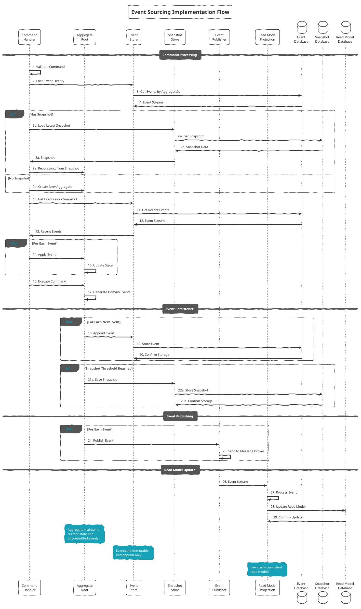
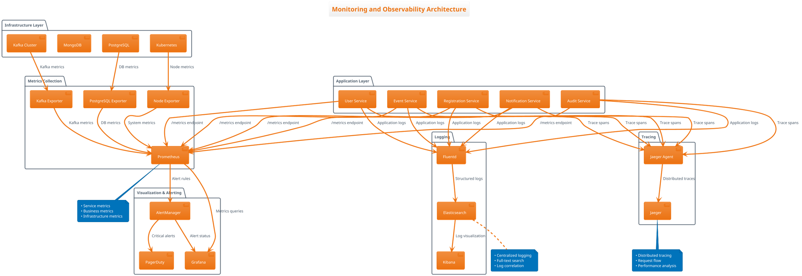
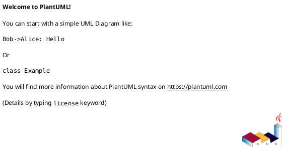

# Advanced PlantUML Sequence Diagrams

## 1. Complete User Registration Flow

```plantuml
@startuml UserRegistrationFlow
!theme aws-orange
title Complete User Registration and Event Registration Flow

actor "User" as user
participant "Frontend\n(Next.js)" as frontend
participant "Gateway\nService" as gateway
participant "User\nService" as userService
participant "Registration\nService" as regService
participant "Event\nService" as eventService
participant "Notification\nService" as notService
participant "Audit\nService" as auditService
database "Kafka\nCluster" as kafka
database "PostgreSQL\n(Users)" as userDB
database "PostgreSQL\n(Events)" as eventDB
database "PostgreSQL\n(Registration)" as regDB
database "MongoDB\n(Audit)" as auditDB

== User Account Creation ==
user -> frontend : 1. Register Account
frontend -> gateway : 2. POST /api/users
gateway -> userService : 3. Create User Request

userService -> userService : 4. Validate Input\n(Email, Username)
userService -> userDB : 5. Check Uniqueness
userDB -> userService : 6. Validation Result

alt Validation Success
    userService -> userDB : 7. Save User
    userDB -> userService : 8. User Created

    userService -> kafka : 9. Publish USER_CREATED
    kafka -> auditService : 10. USER_CREATED Event
    auditService -> auditDB : 11. Log User Creation

    userService -> gateway : 12. Success Response
    gateway -> frontend : 13. 201 Created
    frontend -> user : 14. Account Created
else Validation Failed
    userService -> gateway : 12. Validation Error
    gateway -> frontend : 13. 400 Bad Request
    frontend -> user : 14. Show Error
end

== User Login ==
user -> frontend : 15. Login
frontend -> gateway : 16. POST /api/auth/login
gateway -> userService : 17. Authenticate

userService -> userDB : 18. Verify Credentials
userDB -> userService : 19. User Data

alt Login Success
    userService -> kafka : 20. Publish USER_LOGGED_IN
    kafka -> auditService : 21. USER_LOGGED_IN Event
    auditService -> auditDB : 22. Log Login Activity

    userService -> gateway : 23. JWT Token
    gateway -> frontend : 24. Login Success
    frontend -> user : 25. Dashboard Access
else Login Failed
    userService -> gateway : 23. Authentication Failed
    gateway -> frontend : 24. 401 Unauthorized
    frontend -> user : 25. Invalid Credentials
end

== Event Registration ==
user -> frontend : 26. Register for Event
frontend -> gateway : 27. POST /api/registrations
gateway -> regService : 28. Create Registration

regService -> regService : 29. Validate Event\nand User
regService -> regDB : 30. Save Registration
regDB -> regService : 31. Registration Created

regService -> kafka : 32. Publish REGISTRATION_CREATED

' Parallel processing of registration event
par Event Count Update
    kafka -> eventService : 33a. REGISTRATION_CREATED
    eventService -> eventDB : 34a. Increment Participant Count
    eventDB -> eventService : 35a. Updated
    eventService -> kafka : 36a. Publish EVENT_UPDATED
    kafka -> auditService : 37a. EVENT_UPDATED Event
    auditService -> auditDB : 38a. Log Event Update
and Email Notification
    kafka -> notService : 33b. REGISTRATION_CREATED
    notService -> userService : 34b. Get User Email
    userService -> notService : 35b. User Details
    notService -> notService : 36b. Send Email
    notService -> kafka : 37b. Publish NOTIFICATION_SENT
    kafka -> auditService : 38b. NOTIFICATION_SENT Event
    auditService -> auditDB : 39b. Log Email Sent
and Audit Logging
    kafka -> auditService : 33c. REGISTRATION_CREATED
    auditService -> auditDB : 34c. Log Registration
end

regService -> gateway : 40. Registration Success
gateway -> frontend : 41. 201 Created
frontend -> user : 42. Confirmation Message

note over kafka : All events flow through\nKafka for loose coupling\nand scalability

@enduml
```

## 2. Event Sourcing Implementation Flow



## 3. Microservices Deployment Strategy

```plantuml
@startuml DeploymentStrategy
!theme cyborg-outline
title Zero-Downtime Deployment Strategy

participant "CI/CD\nPipeline" as cicd
participant "Container\nRegistry" as registry
participant "Kubernetes\nCluster" as k8s
participant "Load\nBalancer" as lb
participant "Service A\n(Current)" as serviceA
participant "Service A\n(New)" as serviceB
participant "Health\nCheck" as health
participant "Monitoring" as monitoring

== Build Phase ==
cicd -> cicd : 1. Run Tests
cicd -> cicd : 2. Build Docker Image
cicd -> registry : 3. Push Image
registry -> cicd : 4. Image Available

== Deployment Phase ==
cicd -> k8s : 5. Deploy New Version
k8s -> k8s : 6. Pull New Image
k8s -> serviceB : 7. Start New Pods

== Health Check Phase ==
loop Health Check Retry
    k8s -> health : 8. Check Health
    health -> serviceB : 9. GET /health
    serviceB -> health : 10. Health Status
    health -> k8s : 11. Health Report

    alt Healthy
        k8s -> k8s : 12. Mark Ready
    else Unhealthy
        k8s -> k8s : 12. Keep Checking
    end
end

== Traffic Switching ==
k8s -> lb : 13. Update Service Endpoints
lb -> lb : 14. Gradual Traffic Shift

par Current Traffic
    lb -> serviceA : 15a. 90% Traffic
    serviceA -> lb : 16a. Response
and New Traffic
    lb -> serviceB : 15b. 10% Traffic
    serviceB -> lb : 16b. Response
end

== Monitoring Phase ==
monitoring -> monitoring : 17. Monitor Metrics
monitoring -> monitoring : 18. Check Error Rates

alt Deployment Success
    k8s -> lb : 19a. Full Traffic to New
    par Full New Traffic
        lb -> serviceB : 20a. 100% Traffic
        serviceB -> lb : 21a. Response
    and Cleanup
        k8s -> serviceA : 20b. Terminate Old Pods
    end
else Deployment Failure
    k8s -> lb : 19b. Rollback Traffic
    lb -> serviceA : 20b. 100% Traffic
    k8s -> serviceB : 21b. Terminate New Pods
end

note over lb : Blue-Green Deployment\nwith Gradual Traffic Shift
note over monitoring : Automated rollback\non error threshold

@enduml
```

## 4. Error Handling and Compensation Flow

```plantuml
@startuml ErrorHandlingFlow
!theme plain
title Error Handling and Compensation Flow

participant "User\nService" as userSvc
participant "Registration\nService" as regSvc
participant "Event\nService" as eventSvc
participant "Notification\nService" as notSvc
participant "Kafka\nBroker" as kafka
participant "Dead Letter\nQueue" as dlq
participant "Audit\nService" as auditSvc

== Successful Flow ==
userSvc -> kafka : 1. USER_CREATED Event
kafka -> regSvc : 2. Process Event
regSvc -> regSvc : 3. Create Registration
regSvc -> kafka : 4. REGISTRATION_CREATED Event

par Parallel Processing
    kafka -> eventSvc : 5a. Update Event Count
    eventSvc -> eventSvc : 6a. Success
and
    kafka -> notSvc : 5b. Send Notification
    notSvc -> notSvc : 6b. Success
and
    kafka -> auditSvc : 5c. Log Event
    auditSvc -> auditSvc : 6c. Success
end

== Error Scenarios ==

alt Temporary Network Error
    kafka -> notSvc : 7. REGISTRATION_CREATED
    notSvc -> notSvc : 8. Network Timeout

    loop Retry Logic (3 attempts)
        notSvc -> notSvc : 9. Retry Processing
        alt Success
            notSvc -> kafka : 10a. NOTIFICATION_SENT
        else Still Failed
            notSvc -> notSvc : 10b. Continue Retry
        end
    end

    alt Max Retries Exceeded
        notSvc -> dlq : 11. Send to DLQ
        dlq -> auditSvc : 12. Log Failure
        auditSvc -> auditSvc : 13. Alert Operations
    end

else Database Connection Error
    kafka -> eventSvc : 14. REGISTRATION_CREATED
    eventSvc -> eventSvc : 15. DB Connection Failed

    eventSvc -> eventSvc : 16. Circuit Breaker Open
    eventSvc -> dlq : 17. Send to DLQ
    dlq -> auditSvc : 18. Log DB Error

    ' Compensation
    auditSvc -> kafka : 19. COMPENSATION_REQUIRED
    kafka -> regSvc : 20. Compensate Registration
    regSvc -> regSvc : 21. Mark as Pending
    regSvc -> kafka : 22. REGISTRATION_COMPENSATED

else Business Logic Error
    kafka -> eventSvc : 23. REGISTRATION_CREATED
    eventSvc -> eventSvc : 24. Event Capacity Exceeded

    eventSvc -> kafka : 25. REGISTRATION_REJECTED
    kafka -> regSvc : 26. Handle Rejection
    regSvc -> regSvc : 27. Refund/Cancel
    regSvc -> kafka : 28. REGISTRATION_CANCELLED

    kafka -> notSvc : 29. Send Cancellation Email
    notSvc -> kafka : 30. NOTIFICATION_SENT
end

== Dead Letter Queue Processing ==
dlq -> dlq : 31. Periodic Review
dlq -> auditSvc : 32. Manual Investigation
auditSvc -> auditSvc : 33. Root Cause Analysis

alt Issue Resolved
    auditSvc -> kafka : 34a. Replay Message
    kafka -> eventSvc : 35a. Retry Processing
else Permanent Failure
    auditSvc -> auditSvc : 34b. Log Permanent Failure
    auditSvc -> kafka : 35b. PERMANENT_FAILURE
end

note over dlq : DLQ prevents\nmessage loss and\nenables manual recovery
note over kafka : Kafka provides\nat-least-once delivery\nwith idempotent consumers

@enduml
```

## 5. Monitoring and Alerting Architecture



## How to Generate These Diagrams

### Online PlantUML Server
1. Go to [PlantUML Online Server](http://www.plantuml.com/plantuml/uml/)
2. Paste any of the above PlantUML code
3. Click "Submit" to generate the diagram
4. Download as PNG, SVG, or PDF

### VS Code Extension
1. Install "PlantUML" extension by jebbs
2. Create `.puml` files with the code
3. Press `Alt+D` to preview
4. Right-click to export in various formats

### Command Line
```bash
# Install PlantUML
npm install -g node-plantuml

# Generate diagram
puml generate diagram.puml --png
```

### Integration with Documentation
```markdown
<!-- In your Markdown files -->


<!-- Or embedded -->


### Customization Tips
- Use `!theme` for different color schemes
- Add `!define` for custom colors and styles
- Use `note` elements for explanations
- Customize with `skinparam` for fine-tuning
- Use `!include` to reuse common elements
