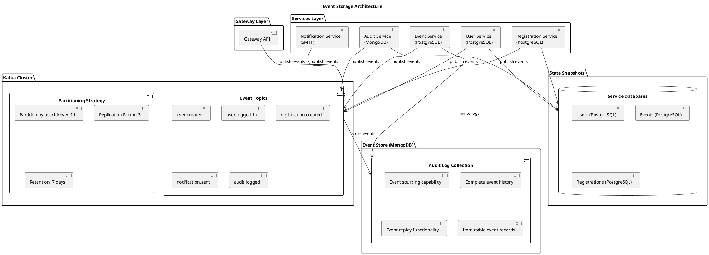
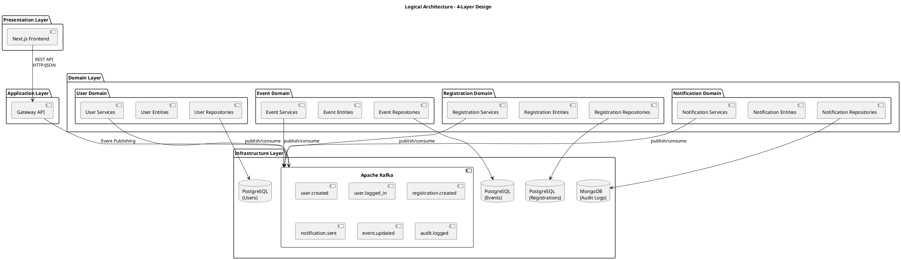
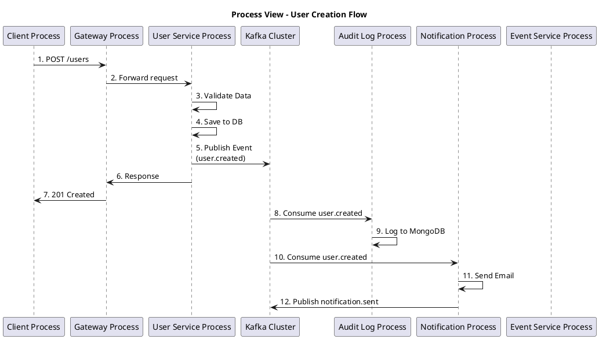
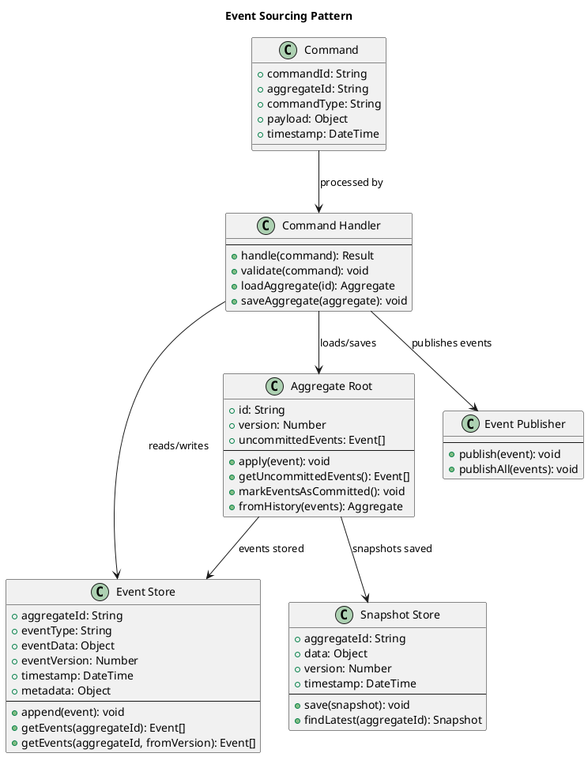
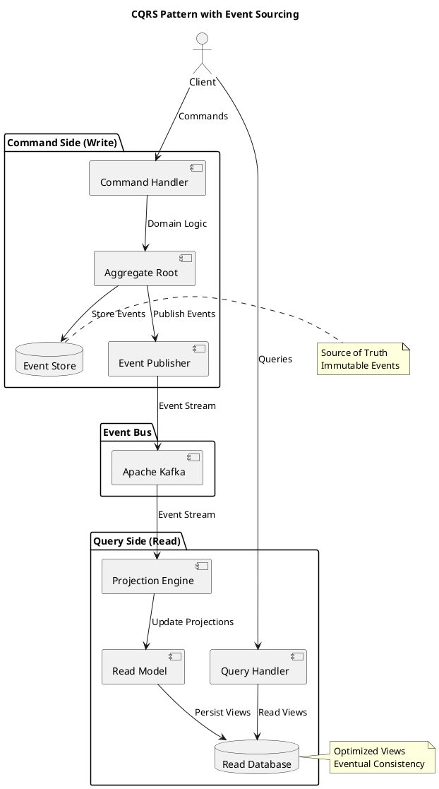
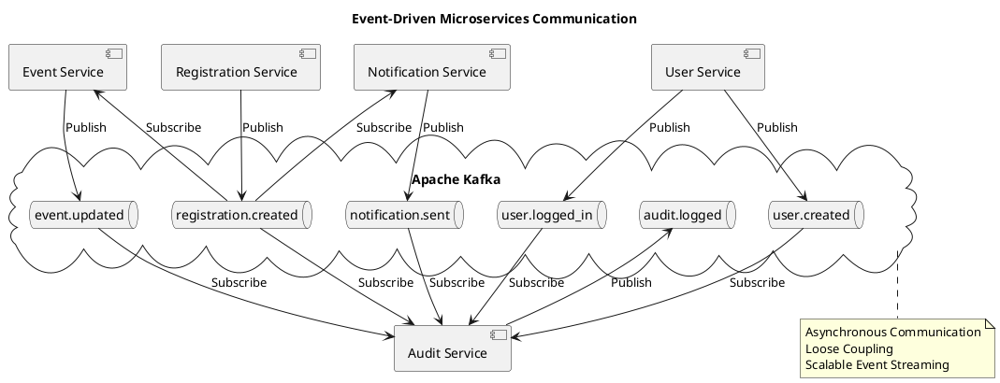
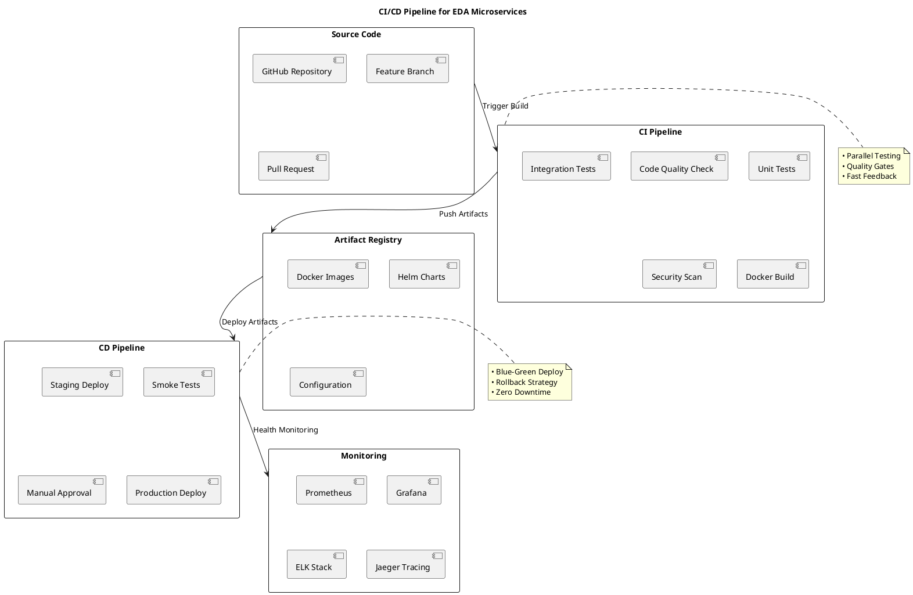

# PlantUML Diagrams for Event-Driven Architecture

## 1. Event Storage Architecture Diagram



## 2. Logical Architecture Diagram



## 3. Process View - Event Flow



## 4. Deployment Architecture

```plantuml
@startuml DeploymentArchitecture
!define NODE node
!define COMPONENT component

title Deployment Architecture

NODE "Production Cluster" {

    package "Load Balancer Tier" {
        NODE "Nginx Load Balancer" {
            COMPONENT [SSL Termination]
            COMPONENT [Health Checks]
        }

        NODE "API Gateway" {
            COMPONENT [Rate Limiting]
            COMPONENT [Authentication]
            COMPONENT [Routing]
        }

        NODE "Web Frontend" {
            COMPONENT [Next.js App]
            COMPONENT [Static Assets]
            COMPONENT [CDN]
        }
    }

    package "Microservices Tier" {
        NODE "User Service Cluster" {
            COMPONENT [Instance 1]
            COMPONENT [Instance 2]
        }

        NODE "Event Service Cluster" {
            COMPONENT [Instance 1]
            COMPONENT [Instance 2]
        }

        NODE "Registration Service Cluster" {
            COMPONENT [Instance 1]
            COMPONENT [Instance 2]
        }

        NODE "Notification Service Cluster" {
            COMPONENT [Instance 1]
            COMPONENT [Instance 2]
        }

        NODE "Audit Service Cluster" {
            COMPONENT [Instance 1]
        }

        NODE "Gateway Service Cluster" {
            COMPONENT [Instance 1]
        }
    }

    package "Message Broker Tier" {
        NODE "Kafka Broker 1" {
            COMPONENT [Partitions 1-3]
        }

        NODE "Kafka Broker 2" {
            COMPONENT [Partitions 1-3]
        }

        NODE "Kafka Broker 3" {
            COMPONENT [Partitions 1-3]
        }

        NODE "Zookeeper Cluster" {
            COMPONENT [Zookeeper 1]
            COMPONENT [Zookeeper 2]
            COMPONENT [Zookeeper 3]
        }
    }

    package "Data Tier" {
        NODE "PostgreSQL Cluster" {
            database "PostgreSQL Master" {
                COMPONENT [Users DB]
            }
            database "PostgreSQL Replica 1" {
                COMPONENT [Events DB]
            }
            database "PostgreSQL Replica 2" {
                COMPONENT [Registrations DB]
            }
        }

        NODE "MongoDB Cluster" {
            database "MongoDB Shard 1" {
                COMPONENT [Audit Logs]
            }
            database "MongoDB Shard 2" {
                COMPONENT [Event Store]
            }
            database "MongoDB Shard 3" {
                COMPONENT [Snapshots]
            }
        }
    }
}

@enduml
```



## 5. Event Sourcing Pattern



## 6. CQRS Pattern with Event Sourcing



## 7. Microservices Communication Pattern



## 8. Quality Attributes Testing Strategy

```plantuml
@startuml QualityAttributesTesting
!define TESTING component

title Quality Attributes Testing Strategy

package "Scalability Testing" {
    TESTING [K6 Load Testing] as k6
    TESTING [JMeter Performance] as jmeter
    TESTING [Artillery Stress] as artillery
}

package "Availability Testing" {
    TESTING [Chaos Engineering] as chaos
    TESTING [Health Checks] as health
    TESTING [Circuit Breaker] as circuit
}

package "Reliability Testing" {
    TESTING [Message Durability] as durability
    TESTING [Idempotency Testing] as idempotency
    TESTING [Dead Letter Queue] as dlq
}

package "Performance Testing" {
    TESTING [Prometheus Metrics] as prometheus
    TESTING [Grafana Dashboard] as grafana
    TESTING [Latency Monitoring] as latency
}

package "System Under Test" {
    TESTING [EDA Microservices] as system
}

' Testing Connections
k6 --> system : Load Generation
jmeter --> system : Performance Testing
artillery --> system : Stress Testing

chaos --> system : Fault Injection
health --> system : Endpoint Monitoring
circuit --> system : Failure Detection

durability --> system : Message Verification
idempotency --> system : Duplicate Detection
dlq --> system : Error Handling

prometheus --> system : Metrics Collection
grafana --> system : Visualization
latency --> system : Response Time

@enduml
```



## 9. CI/CD Pipeline



## How to Use These Diagrams

1. **Copy the PlantUML code** from each section
2. **Paste into PlantUML editor**:
   - Online: [PlantUML Server](http://www.plantuml.com/plantuml/uml/)
   - VS Code Extension: PlantUML
   - IntelliJ Plugin: PlantUML integration

3. **Generate diagrams** in various formats:
   - PNG for documentation
   - SVG for scalable graphics
   - PDF for presentations

4. **Customize as needed**:
   - Modify colors with `!define` directives
   - Add more details to components
   - Adjust layout with positioning

## Example Usage in VS Code:
```markdown
1. Install "PlantUML" extension
2. Create .puml files with the code above
3. Press Alt+D to preview
4. Export to PNG/SVG for documentation
```
